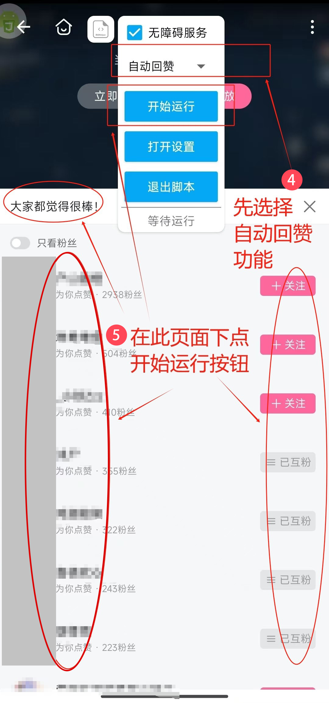

	

<h1 align="center"><b>B 站助手 - BiliHelper</b></h1>

<h4 align="center"><b>基于 Auto.js 的 B 站互赞互助脚本</b></h4>

  <a href="https://github.com/luckyloogn/BiliHelper?tab=readme-ov-file#安装脚本">安装脚本</a> •
  <a href="https://github.com/luckyloogn/BiliHelper?tab=readme-ov-file#运行脚本">运行脚本</a> •
  <a href="https://github.com/luckyloogn/BiliHelper?tab=readme-ov-file#使用说明">使用说明</a> •
  <a href="https://github.com/luckyloogn/BiliHelper?tab=readme-ov-file#测试说明">测试说明</a> •
  <a href="https://github.com/luckyloogn/BiliHelper?tab=readme-ov-file#免责声明">免责声明</a>

## 安装脚本

### 方法一：使用 APK 文件安装

1. 从 [Releases](https://github.com/luckyloogn/BiliHelper/releases/latest) 页面下载最新的 apk 安装包
2. 用 “文件传输助手” 等工具发送到手机
3. 在手机的文件管理器中找到 `BiliHelper_x.x.x.apk` 文件，点击 apk 文件进行安装即可

**注：虽然软件无毒，但是某些安卓手机在安装时可能报毒，请自行解决。如您介意，请终止安装并删除 apk 安装包**

### 方法二：使用项目源码安装

1. 运行源码需要先安装 **[Auto.js](https://github.com/clearw5/Auto.js?tab=readme-ov-file) 类软件**。
   可以是原作者开发的 [Auto.js 4.1.1 免费版](http://www.autojs.cc/)、[Auto.js Pro](http://www.autojs.cc/)，
   也可以是 Github 上开源的二次开发版本，
   如 [Auto.js M](https://github.com/TonyJiangWJ/Auto.js)、[AutoX](https://github.com/kkevsekk1/AutoX)、[AutoJs6](https://github.com/SuperMonster003/AutoJs6)

2. 在本页面右上方找到绿色 “Code” 按钮并单击，接着点 “Download ZIP” 下载本项目，然后用 “文件传输助手” 等工具发送到手机，再通过手机的文件管理器将 zip 文件解压到手机的 `/storage/emulated/0/脚本/` 目录；
   或者通过命令 `git clone https://github.com/luckyloogn/BiliHelper.git` 克隆本项目，使用 [VS Code](https://code.visualstudio.com/) 打开 **BiliHelper** 文件夹，
   再使用 **Auto.js 类软件** 提供的 **VS Code插件**（如 [Auto.js-Autox.js-VSCodeExt-Wilinz](https://marketplace.visualstudio.com/items?itemName=wilinz.autoxjs-ext)、
   [AutoJs6 VSCode Extension](https://marketplace.visualstudio.com/items?itemName=003.autojs6-vscode-ext)）的 **保存项目到设备** 功能将本项目发送到手机

## 运行脚本

### 方法一：对于使用 APK 文件安装

1. 在手机桌面启动器找到 **BiliHelper** 图标，点击打开。首次打开需要授予 **BiliHelper** “显示悬浮窗（允许程序显示在其他所有程序的顶层）” 权限
2. 在屏幕左上角找到 [白色悬浮按钮](./assets/screenshots/3.jpg)，点击按钮展开 “悬浮窗”，在 “悬浮窗” 中 [勾选 “无障碍服务”](./assets/screenshots/4.jpg)，然后会跳转到 **系统设置**
3. 在 **系统设置** 中给 **BiliHelper** 启用 “无障碍服务”

### 方法二：使用项目源码安装

1. 在手机桌面启动器找到 **Auto.js 类软件** 图标，点击打开。首次打开需要授予 **Auto.js 类软件** “显示悬浮窗（允许程序显示在其他所有程序的顶层）” 和 “管理所有文件” 权限
2. 在首页找到 **BiliHelper** 项目，点进去，再点右边 “三角形” 运行脚本
3. 在屏幕左上角找到 [白色悬浮按钮](./assets/screenshots/3.jpg)，点击按钮展开 “悬浮窗”，在 “悬浮窗” 中 [勾选 “无障碍服务”](./assets/screenshots/4.jpg)，然后会跳转到 **系统设置**
4. 在 **系统设置** 中给对应的 **Auto.js 类软件** 启用 “无障碍服务”

    

        
        
        
        
    

## 使用说明

### 脚本设置

运行脚本并展开 “悬浮窗”，在 “悬浮窗” 中可进行脚本功能选择、脚本运行参数设置、脚本退出等操作

    
    
    
    
    

### 自动回赞

给 **给您的视频点赞的用户** 的 **最新** 的一个投稿 **视频** 进行 **点赞+评论（可选）** 操作

1. 运行脚本并展开 “悬浮窗”，在 “下拉菜单” 中选择  “自动回赞” 功能
2. 先在 B 站打开一个投稿视频（我的 -> 稿件管理 -> 目标稿件），点击 “xxx等觉得很赞” 打开 “大家都觉得很棒！” 点赞列表
3. 点击脚本悬浮窗 “打开设置” 按钮设置运行参数，完成设置后点击 “确认设置” 按钮（可选）
4. 再点击脚本 “悬浮窗” 的 “开始运行” 按钮

    

        
        
        
        
    

### 找人互助

在 **xx创作激励页面** 的 **最新** 选项卡按顺序找 **视频** 进行 **点赞+评论（可选）** 操作

1. 运行脚本并展开 “悬浮窗”，在 “下拉菜单” 中选择 “找人互助” 功能
2. 先在 B 站点击话题名或搜索进入 “xx创作激励计划” 页面
3. 点击脚本 “悬浮窗” 的 “打开设置” 按钮设置运行参数，完成设置后点击 “确认设置” 按钮（可选）
4. 再点击脚本 “悬浮窗” 的 “开始运行” 按钮

    

        
        
    

### 给粉丝赞

在 **我的好友-粉丝** 页面给您的粉丝的 **最新** 的一个投稿 **视频** 进行 **点赞+评论（可选）** 操作

1. 运行脚本并展开 “悬浮窗”，在 “下拉菜单” 中选择 “给粉丝赞” 功能
2. 先在 B 站打开自己的粉丝页面（我的 -> 粉丝）
3. 点击脚本按钮展开 “悬浮窗”，点 “打开设置” 按钮设置运行参数，完成设置后点击 “确认设置” 按钮（可选）
4. 再点击脚本 “悬浮窗” 的 “开始运行” 按钮

    

        
        
    

## 测试说明

本项目在 [AutoJs6 (6.6.1)](https://github.com/SuperMonster003/AutoJs6/releases/tag/v6.6.1)、[Auto.js M (4.1.24.0914)](https://github.com/TonyJiangWJ/Auto.js/releases/tag/4.1.24.0914)、[AutoX (7.0.5)](https://github.com/kkevsekk1/AutoX/releases/tag/7.0.5) 和 **B 站 8.28.0** 版本下测试通过

## 免责声明

本项目用作学习参考，使用本项目产生的任何后果需要自行承担
